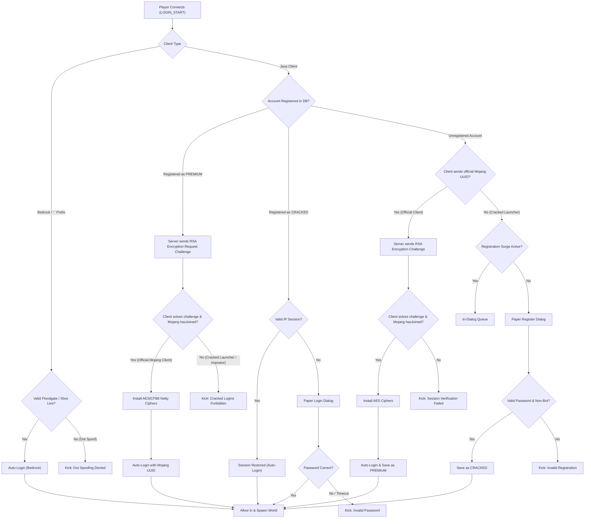

# TirnueAuth

TirnueAuth authenticates players on Paper 1.21.4+ servers before they enter the world. It provides true hybrid authentication on offline-mode (`online-mode=false`) servers: handling passwords, PacketEvents-powered cryptographic Mojang session verification, and Bedrock Floodgate auto-login in a single unified plugin.

* **Official Mojang Clients**: Undergo full cryptographic verification (RSA challenge, AES-CFB8 Netty ciphers, and Mojang `hasJoined` session query) for seamless auto-login with their real Mojang UUID.
* **Cracked Impostors**: If a cracked launcher attempts to connect using an official Mojang username, it fails the cryptographic challenge and is immediately kicked.
* **Cracked Players**: Genuine cracked players authenticate through Paper's native modal dialogs without loading chunks or ticking entities.

---

## Authentication Flow



---

## Features

* **Pre-Join Dialogs**: Cracked players must log in or register via Paper's native dialog screen (`io.papermc.paper.dialog.Dialog`). They never spawn into the world without authenticating.
* **Mojang Auto-Login & Strict Lockout**: Official Mojang accounts bypass passwords automatically. Once registered as premium, any cracked attempt to log into that username is instantly kicked with zero password prompts.
* **Bedrock Support**: Bedrock players log in automatically through Floodgate and Xbox Live. Java clients attempting to spoof `.` usernames are kicked on pre-login.
* **Anti-Bot Protection**: Form submissions faster than 800ms are kicked as bots. Rapid registration bursts automatically route new accounts into an in-dialogue queue.
* **Mojang API Throttling**: A token-bucket limiter keeps outbound Mojang lookups under rate limits to prevent IP bans and connection stalls.
* **AuthMe Importer**: Migrates existing user accounts, salts, and SHA-256 hashes straight out of `plugins/AuthMe/authme.db`.

---

## Commands

### Player Commands (`tirnue.auth.user`)

| Command | Aliases | Description |
| :--- | :--- | :--- |
| `/login <password>` | `/l`, `/log` | Log into your account (redirects cracked users to the pre-join dialog). |
| `/register <password> [confirm]` | `/reg` | Register an account with a password. |
| `/changepassword <old> <new>` | `/changepw`, `/cpw` | Change your password or set a premium backup password. |
| `/logout` | `/unlog` | End current session. |
| `/premium` | `/prem`, `/tpremium` | Turn on Mojang auto-login for your username. |
| `/cracked` | `/unpremium`, `/tcracked` | Switch account back to password mode. |

### Admin Commands (`tirnue.auth.admin`)

| Command | Description |
| :--- | :--- |
| `/tauth status` | View rate limiter tokens, join surge state, and queue activity. |
| `/tauth ipbind [on\|off]` | Toggle premium IP-binding checks. |
| `/tauth surge [on\|off]` | Toggle connection surge detection. |
| `/tauth ratelimit [on\|off]` | Toggle Mojang API token-bucket rate limiter. |
| `/tauth regsurge [on\|off\|reset]` | Toggle or reset the registration queue. |
| `/tauth check <player>` | Inspect an account's auth mode, UUID, IP, and login state. |
| `/tauth set <player> <mode>` | Change auth mode (`PREMIUM`, `CRACKED`, `BEDROCK`). |
| `/tauth unregister <player>` | Remove an account from the database. |
| `/tauth forcelogin <player>` | Force-login an online player. |
| `/tauth import` | Import accounts from `plugins/AuthMe/authme.db`. |
| `/tauth reload` | Reload configuration and messages. |

---

## Placeholders

Requires PlaceholderAPI:

| Placeholder | Outputs | Description |
| :--- | :--- | :--- |
| `%tirnueauth_is_logged_in%` | `true` / `false` | Authentication state. |
| `%tirnueauth_type%` | `BEDROCK`, `PREMIUM`, `CRACKED`, `UNREGISTERED` | Account type. |
| `%tirnueauth_registered%` | `true` / `false` | Registration state. |
| `%tirnueauth_is_bedrock%` | `true` / `false` | Bedrock client check. |

---

## Building

Requires JDK 21+ and a Paper 1.21.4+ server jar in classpath:

```bash
./build.sh
```
